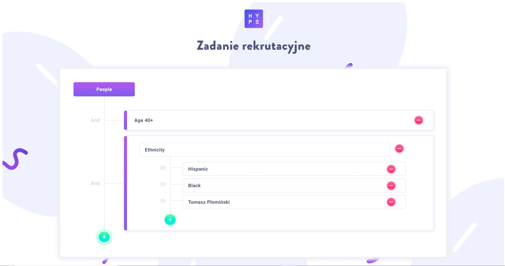

## Scripts

pls use npm for instalation of the packages:

### 'npm install'

to run the app on the localhost:3000 use this command:

### 'npm run start'

## About App

This is a one screen app that i have built basing on a template design, as my recruitments

### App Visual

[Check the app here] (http://TheKapitanKorek.github.io/TableApp)

## Technologies used:

### type-script

### react

### sass
